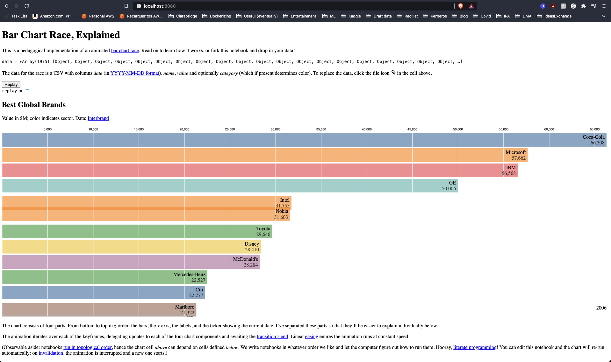

# Creating a Bar Chart Visualization

I'm pretty sure everybody's seen those cool bar charts that are animated through time where you can see each bar "compete" against each other. See an example here:

EXAMPLE

However, most of the times these are created using a tool. The purpose of this post is to show you how to create them (and embed them in your website) the easiest way I've personally found. You just need a little bit of JS and HTML and you should be all set.

## Observable

I've said before I'm a big fan of Jupyter Notebooks and tools like [nbdev](https://github.com/fastai/nbdev) which allows you to develop a Python Library using nothing more than Jupyter Notebooks. So you can imagine my excitement when I discovered [Observable](https://observablehq.com/) where you can pretty much create any visualization you can think of, in a Notebook!!!

## Enter https://observablehq.com/@d3/bar-chart-race-explained

If you follow [this link](https://observablehq.com/@d3/bar-chart-race-explained) it takes you to an awesome Notebook where @mbostock takes you step by step on how to create a Bar Chart Race.\
Since the purpose of this post is not so much to explain how D3.js works bur rather how to quickly create the visualization and use for your own purposes, I won't go into the details. However, you'd only need the data for the race in a CSV with columns date (in YYYY-MM-DD format), name, value and optionally category (which if present determines color).\

## Embedding the Bar Chart Race visualization

After you have your visualization ready, you can just select the cell, go to to the 3-dotted menu on the top right corner and copy the iFrame. See the images below:

**But** sometimes the data you're trying to show it's not for the public and the notebooks need to be in order for you to be able to embed the cells as iFrames.

## Enter "Download Code"

Observable also allows you to download the code of the Notebook. This way you can customize and use it as you like. \
Now, if you were to deploy the downloaded code to an HTTP server it will look like this:

Which doesn't look great and has all the text from Observable. So I created the following that gets rid of all of that and 

TODO: check https://observablehq.com/@observablehq/downloading-and-embedding-notebooks